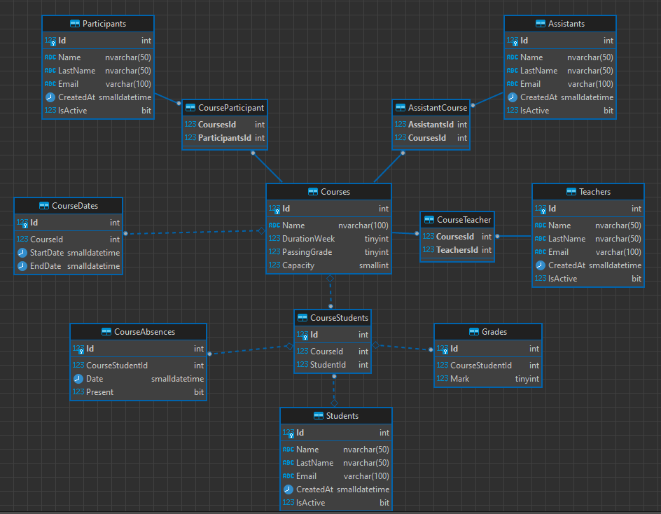

# Week 3

This homework includes the task of **SQL Database Design** for PatikaDev System. 

## Our Goals

Veritabanı 
1. Patikadev yapısını düşünerek bir db oluşturun
  - eğitimler, öğrenciler,katılımcılar,eğitmenler,asistanlar, eğitimde öğrencilerin yoklamalarının ve başarı durumlarının tutulduğu tablolar olacaktır.
  - veritipleri ve ilişkiler belirtilmelidir.
2. trigger yazın
  - öğrenci yoklaması girildiğinde. yoklama durumuna göre başarı durumunu hafta bazlı olarak güncelleyin.(Örn: eğitim 7 hafta olsun. ilk iki hafta derslere katıldı ise başarı oranı 2/7 nin % olarak karşılı olmalı.)
3. stored procedure yazın
  - öğrencileri eğitimlere ekleyen bir procedure olacak. öğrenci belirtilen eğitim tarihinde herhangi başka bir eğitime kayıtlı olmamalıdır.
4. view yazın
  - eğitim bazlı öğrencileri listeleyin(gruplu olarak)
5. Bonus
  - Aynı yapıyı ef code first olarak sadece model bazında oluşturun

## Key Points

- Tables created as shown below
  - Participants, Assistants, Teachers and Students stored in seperate tables. These objects may have different properties in the future. So, shouldn't be combined in same table
  - There can be more than one assistant, participant and student in each course. So, separate tables has been created for releationship between these entities and Courses.
  - Each course has only one teacher for now. So, it is possible to put **TeacherId** in **Courses** table BUT because of this design can change in the future, teacher-course releation moved to seperate folder.
  - Name, Lastname properties have been chosen NVarChar(50) due to containing special characters (Turkish),
  - Email property is not able to contain special characters, so it has been chosen VarChar(100),
  - The max value of Mark and PassingGrade are 100, so defined as tinyint
  - Booleans defined as bit,
  - Date properties have been chosen SmallDateTime to not store unnecessary data.
  - The Foreign Key for **Grades** and **CourseAbsences** tables was selected from the **CourseStudents** table. In this way, we can easily prevent inserting record for students without courses.
    

- Trigger TR_CourseAbsences_InsteadOfInsert created to increase students' mark when they attend class.
  - In this trigger, We used "instead of" type. If there is an issue with date information, we won't run query and we will throw an error
  - If the query contains a different date than the course date range, throw an error.

- Stored Procedure proc_JoinCourse created to check student's availability before attending a new course.
  - There are 3 possibilities for courses to overlap :
  - Starting date of new course may overlap with the existing course date range  OR
  - End date of new course may overlap with the existing course date range  OR
  - New course starts before the date of a existing course and ends after end date of that course.

- View vw_StudentList created to return students with course information. It has been ordered by courses.

- EF codefirst model has been created.
  - Used baseEntity for Students, Assistants, Participants and Teachers.
  - Releation tables haven't been defined except **CourseStudents**. Because We are going to control this table and need to create manually
